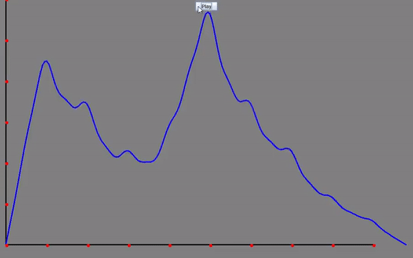
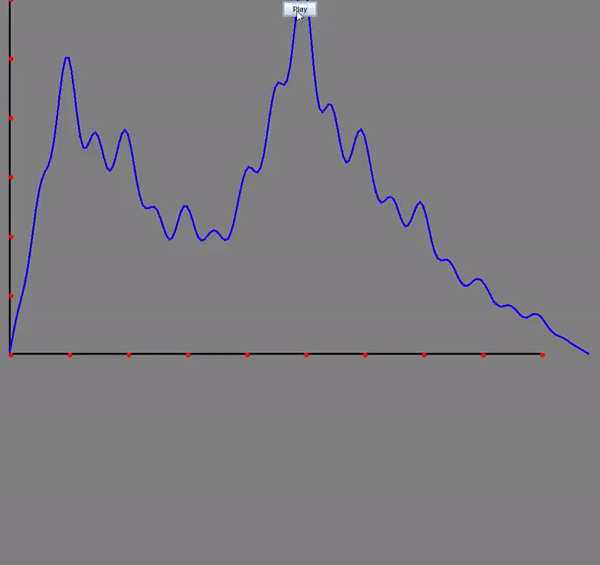

# Evertything is dummy text except the preview

## Description

This program will numerically solve the heat equation in 2D by approximation using the finite difference method. The domain will be a square with the boundary condition set to 0 around the square. The initial value will be given by polynomial spline surface over the whole domain. This spline surface is constructed from input points in 3D-space given by the user. From the spline surface we create an n by n mesh. The value at each tile in the mesh will store the value of the surface polynomial at that point in a 2D array. This array will be passed to a function that determines how the surface will look like in the next iteration.

## How to Use

No app exists for this project (apart from three demos in the 'executables' folder). To test with your own examples, download the code and run MainHeat.java. The following steps display how to proceed.

1. The user chooses the desired settings found in MainHeat.java. This includes values like drawer parameter settings (e.g. window size, pixel size), heat equation parameter settings (thermal diffusion constant alpha), numerial parameter settings (e.g. deltaTime, mesh size) and animation parameter settings (e.g. number of frames). 

2. The user inputs at least one point to construct the spline surface that represents the heat distributed at time 0.

3. Run MainHeat.java.

## Implementations
### Hermite Spline interpolation

It will be a form of hermite spline interpolation. There will be a single spline surface over the whole domain, no stitching.

The spline interpolation is a weaker implementation of a general spline surfare, that is, it does not model the interaction between the x and y varaibles. Non-linear relationships between x and y can thus not be modeled (there are no terms on the form x^ay^b where a,b are positive integers). The result is a potensial less accurate spline model in cases of non-linearity between x,y.

### Finite Difference Method

The implementation of the finite difference method is somewhat unstable. For example, setting the thermal diffusion constant to high can lead to the appearence of 'artifact' issues. The value of 'deltaTime' in MainHeat.java can also affect this. 
		
### Drawing

Loop through the grid and set every pixel to a grayscale color determined by the value of the temperature. In order to make better use of the full range of 0 to 255 grayscale values, we scale the temperatures we scale the temperatures to better fit this scale. As the overall temperature gets lower (which will eventually happen due to the boundary condition being 0), we want to reflect this in the drawing. If we kept scaling to the range 0 to 255, the pixels would not dim as time went on. To fix this, we multiply every pixel (after scaling to the range 0 to 255) with a percentage. This percentage is calculated based on the highest temperature in this iteration compared to the highest temperature in the first iteration (the temperature in the first iteration will always be higher). This will give a natural dimming to all the pixels over time. 

## Dependencies

Uses the javax.swing package to render graphical elements and the EJML java library version 0.43 (simple matrix) for matrix calculations.

## Preview

### Heat Equation

### Wave Equation

### Wave Equation with Dampening

